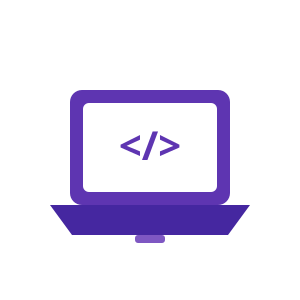
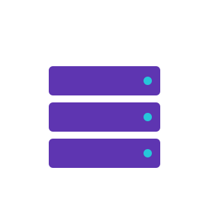

---
hide:
  - navigation
---

# Materiały — Informatyka

Witaj na stronie z materiałami do zajęć z informatyki zawodowej.

-   { width="90" }

    **Podstawy Programowania**

    ---

    Materiały, zadania i powtórka dla klas 3 i 4

    [:octicons-arrow-right-24: Przejdź](podstawy-programowania/index.md)

-   { width="90" }

    **ASO**

    ---

    Administracja Systemami Operacyjnymi — materiały i zadania

    [:octicons-arrow-right-24: Przejdź](aso/index.md)

